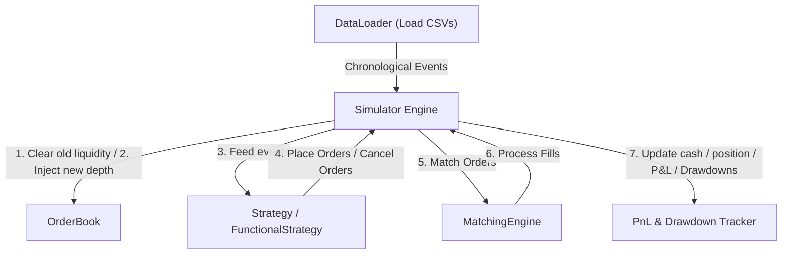

# HFT-Grade C++ Backtester & Matching Engine

A high-performance, low-latency, and multi-threaded backtesting simulation suite built in C++17. Designed to simulate and evaluate quantitative trading strategies using historical order book snapshots and trade logs (compatible with IMC Prosperity market data format).

## Features

- **L3 Limit Order Book**: Uses intrusive doubly-linked lists (`Order* prev, next` within the `Order` struct) at each price level, paired with a fast hash map lookup (`std::unordered_map`) for $O(1)$ order cancellation and deletion.
- **FIFO Matching Engine**: Real-time order matching executing BUY and SELL orders under strict price-time priority.
- **DataLoader**: Semicolon-delimited CSV parser designed to load interleaved, multi-asset market data depth snapshots and trade logs.
- **Simulator**: Orchestrates chronological event execution, matches limit and market strategy orders, and maintains accurate state (cash, position, weighted average entry price, realized P&Ls, and absolute/percentage drawdowns).
- **MultiBacktester**: Spawns concurrent C++ threads (`std::thread`) to run independent strategy backtests or parameter sweeps in parallel, returning a sorted comparative performance leaderboard.
- **Flexible Strategy APIs**: Support for both class-based inheritance (`Strategy` class) and plain standalone functions (`FunctionalStrategy` wrapper) to simplify strategy writing.
- **Memory-Safe**: Zero leaks guaranteed through custom class-specific memory allocation tracking.

---

## Architecture



---

## Directory Structure

```
├── DataLoader/       # CSV Parser for snapshots & market trades
├── MatchingEngine/   # FIFO matching logic & trade generation
├── OrderBook/        # L3 OrderBook, PriceLevels, and Order structures
├── Simulator/        # Chronological driver, P&L analytics, and MultiBacktester
├── Strategy/         # Strategy abstract base and FunctionalStrategy wrapper
└── main.cpp          # Integration tests & performance benchmarks
```

---

## How to Build and Run

### 1. Compile (Release Build - Optimized)
For performance testing and benchmarking, compile with level 3 optimization (`-O3`):
```bash
g++ -O3 -std=c++17 -IOrderBook -IMatchingEngine -IDataLoader -IStrategy -ISimulator main.cpp OrderBook/OrderBook.cpp MatchingEngine/MatchingEngine.cpp DataLoader/DataLoader.cpp Simulator/Simulator.cpp Simulator/MultiBacktester.cpp -o test_runner.exe
```

### 2. Run the Test Runner
```bash
.\test_runner.exe
```

---

## Writing a Strategy

You can write your trading logic in two ways:

### Option A: Plain-Function Style (Recommended for simplicity)
Write a standalone function and wrap it using `FunctionalStrategy`:

```cpp
void myTradingRule(Simulator* sim, const BookSnapshot& snapshot) {
    int position = sim->getPosition();
    int bestAsk = snapshot.askPrice1;

    // Buy 5 shares if best ask drops below 11,000
    if (bestAsk > 0 && bestAsk < 11000 && position == 0) {
        sim->submitStrategyOrder(Side::BUY, 20000, 5);
    }
}
```
Add it to the parameter sweep:
```cpp
factories.push_back({"MySimpleStrategy", [](Simulator* sim) {
    return new FunctionalStrategy(sim, myTradingRule);
}});
```

### Option B: OOP Class-Based Style
Inherit from `Strategy` for complex state tracking:

```cpp
class MyComplexStrategy : public Strategy {
private:
    int threshold;
public:
    MyComplexStrategy(Simulator* sim, int thresh) : Strategy(sim), threshold(thresh) {}

    void onDepthUpdate(const BookSnapshot& snapshot) override {
        // Your logic here
    }
    void onMarketTrade(const HistoricalTrade& trade) override {
        // Your logic here
    }
};
```

---

## Performance Benchmarks

Below are the benchmark metrics obtained for processing **1,000,000 orders** on a single thread (compiled with `-O3` vs `-O0`):

| Build Type | Optimization Flag | Total Time | Throughput | Average Latency |
| :--- | :---: | :---: | :--- | :---: |
| **Debug** | `-O0` | ~0.817s | 1.22M orders/sec | 816.9 ns |
| **Release** | `-O3` | **~0.358s** | **2.79M orders/sec** | **357.9 ns** |

*Note: Enabling release optimizations achieves a **128.2% throughput increase** and cuts average matching latency in half (reduced by **56.2%**).*
